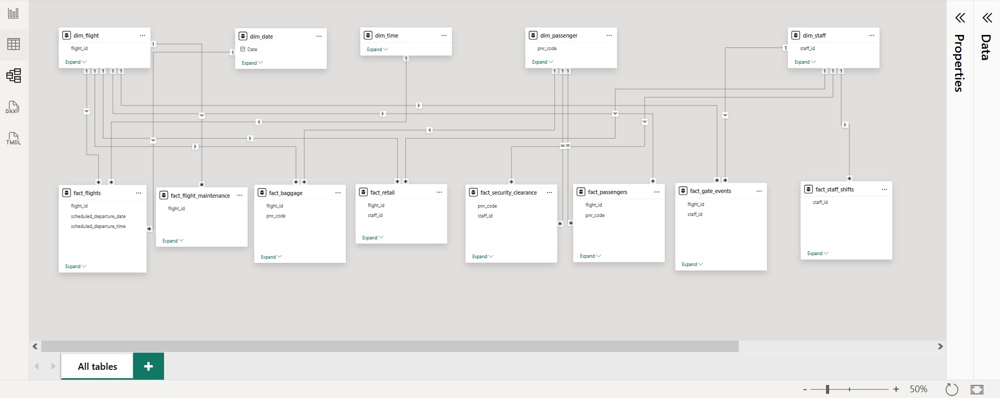
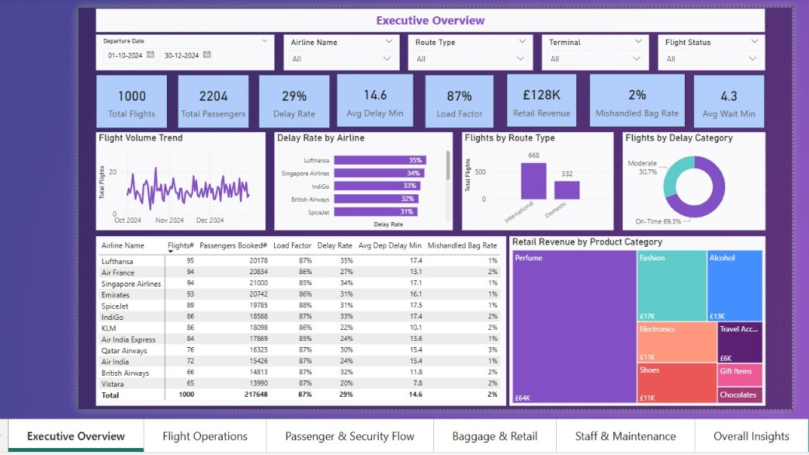

# ✈️ Airport Operations Analysis Dashboard | Power BI  
### Flight Performance, Delay Analysis, Passenger Trends & Operational Intelligence  


---

# 📌 Executive Summary

The **Airport Operations Analysis Dashboard** is an enterprise-grade aviation analytics solution built using **Power BI**, designed to transform complex multi-domain airport operational data into actionable intelligence.

This project integrates data from flights, passengers, baggage, retail, staffing, and aircraft maintenance into a unified business intelligence framework that enables airport management teams to:

- Monitor flight punctuality and delay patterns
- Analyze passenger movement and security efficiency
- Optimize baggage operations
- Track retail revenue performance
- Evaluate workforce productivity
- Assess maintenance risks and aircraft downtime
- Generate dynamic operational insights for strategic decisions

---

# 🎯 Business Objectives

This dashboard answers critical operational questions such as:

- Are flights departing and arriving on schedule?
- Which airlines, routes, gates, or delay reasons require intervention?
- How efficiently are passengers moving through check-in and security?
- Where are baggage mishandling risks occurring?
- Which retail stores and product categories drive airport revenue?
- How are staffing shortages, overtime, and maintenance affecting operations?

---

# 🛠️ Tools & Technologies

- **Power BI Desktop**
- **Power Query**
- **DAX (Data Analysis Expressions)**
- **Excel / CSV Data Sources**
- **Data Modeling**
- **KPI Dashboard Development**
- **Interactive Slicers & Drill-Down Reporting**
- **Business Intelligence Storytelling**

---

# 🗂️ Data Architecture

## ⭐ Star Schema Data Model

The dashboard uses a scalable star-schema architecture for efficient filtering, performance optimization, and analytical flexibility.



### Dimension Tables:
- `dim_flight`
- `dim_passenger`
- `dim_staff`
- `dim_date`
- `dim_time`

### Fact Tables:
- `fact_flights`
- `fact_passengers`
- `fact_baggage`
- `fact_gate_events`
- `fact_security_clearance`
- `fact_retail`
- `fact_staff_shifts`
- `fact_flight_maintenance`

### Model Design:
- Single-direction filtering
- Centralized dimensions
- Optimized DAX calculations
- Cross-functional operational analytics

---

# 📊 Dashboard Pages & Functionalities



---

## 1️⃣ Executive Overview

A strategic summary page for airport leadership.

### Core KPIs:
- Total Flights
- Total Passengers
- Delay Rate
- Average Delay Time
- Load Factor
- Retail Revenue
- Mishandled Bag Rate
- Average Queue Wait Time

### Visual Analytics:
- Flight Volume Trends
- Delay Rate by Airline
- Route Type Performance
- Delay Category Breakdown
- Retail Revenue by Product Category

---

## 2️⃣ Flight Operations Dashboard

Focused on operational efficiency and punctuality.

### Key Metrics:
- On-Time Performance
- Cancellation Rate
- Passengers per Flight
- Delay Reason Analysis
- Turnaround Time
- Weather Delay Impact
- Gate Utilization Efficiency

### Operational Insights:
- Airline punctuality benchmarking
- Aircraft turnaround optimization
- Delay root cause identification

---

## 3️⃣ Passenger & Security Flow Dashboard

Monitors passenger processing efficiency.

### KPIs:
- Checked-In Passengers
- No-Show Rate
- Average Queue Wait
- Security Screening Duration
- Secondary Screening Rate
- Missed Flights After Security

### Insights:
- Security lane bottlenecks
- SLA breach identification
- Passenger flow optimization

---

## 4️⃣ Baggage & Retail Dashboard

Combines baggage operational performance with commercial analytics.

### Baggage Metrics:
- Total Bags Processed
- Mishandled Bags
- Mishandled Bag Rate
- Average Bag Weight
- Baggage Status Distribution

### Retail Metrics:
- Total Revenue
- Revenue per Passenger
- Average Transaction Value
- Product Category Performance
- Store-Level Revenue

### Strategic Value:
- Commercial profitability optimization
- Baggage risk management

---

## 5️⃣ Staff & Maintenance Dashboard

Evaluates workforce efficiency and aircraft reliability.

### Workforce KPIs:
- Active Staff
- Shift Allocation
- Scheduled Hours
- Overtime Rate
- Department Productivity

### Maintenance KPIs:
- Maintenance Work Orders
- Grounded Aircraft
- Downtime Hours
- Maintenance Type Analysis
- Component Failure Trends

### Business Impact:
- Resource planning
- Cost optimization
- Operational continuity

---

## 6️⃣ Dynamic Insights Page

Advanced DAX-powered narrative intelligence.

### Examples:
- Top airline by delay rate
- Highest baggage risk carrier
- Leading retail category
- Most congested security lane
- Highest downtime aircraft type

### Features:
- Slicer-responsive text insights
- Executive-ready summaries
- Automated performance storytelling

---

# 📈 Core Business KPIs

| Category | KPIs |
|---------|------|
| Flight Operations | Delay Rate, On-Time %, Cancellations |
| Passenger Flow | Queue Wait, No-Show %, Security SLA |
| Baggage | Mishandled Bag Rate, Bag Tracking |
| Retail | Revenue, ATV, Revenue per Passenger |
| Staff | Shift Coverage, Overtime |
| Maintenance | Downtime, Work Orders, Grounded Aircraft |

---

# 📚 Skills Demonstrated

- Data Cleaning & Transformation
- Power Query ETL
- Advanced Data Modeling
- DAX Measure Engineering
- Dashboard UX/UI Design
- Aviation Operations Analytics
- KPI Development
- Business Intelligence Storytelling
- Executive Reporting
- Performance Optimization

---

# 📂 Project Structure

```bash
airport_operations_analysis_pbi/
│
├── data/                                         # Raw operational datasets
├── export/                                       # PDF exports / presentations
├── screenshots/                                  # Dashboard images
├── Airport Operations Performance Dashboard.pbix # Main Power BI dashboard
└── README.md

```

```bash
# ⚙️ Installation & Usage Guide

## Prerequisites:
- Power BI Desktop
- Local dataset files

## Steps:

### 1. Clone the repository:

### 2. Open the `.pbix` file in Power BI Desktop

### 3. Update source file parameters if necessary

### 4. Refresh Power Query connections

### 5. Validate data model relationships

### 6. Publish to Power BI Service or export to PDF

```

---

# 🚀 Key Project Achievements

- Built an end-to-end airport intelligence solution
- Unified operational, passenger, retail, and maintenance domains
- Developed advanced DAX-driven KPIs
- Created dynamic narrative insights
- Designed executive-level dashboard architecture
- Improved operational decision-making capability

---

# 🔮 Future Enhancements

- Real-time airport API integration
- Predictive delay forecasting
- Passenger congestion forecasting
- AI-powered anomaly detection
- Mobile dashboard deployment
- Power BI Service automation

---

# 👨‍💻 Author

## Vidhi Jajodia

### Connect:
- GitHub: https://github.com/vidhi-jajodia
- LinkedIn: https://www.linkedin.com/in/vidhi-jajodia/

---
